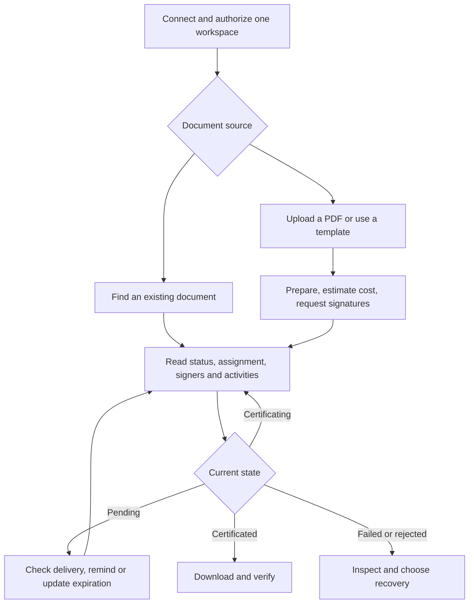

# Assinafy MCP client guide

Connect once with **Assinafy OAuth2 and CIMD**, then manage the document lifecycle
through MCP tools: prepare and send, check status and delivery, resend reminders,
update expiration, download artifacts, and recover incomplete work.

Use the deployed HTTPS Streamable HTTP URL ending in `/mcp`; replace the example
host with the endpoint supplied by the operator. Claude and Codex discover their
CIMD identities automatically. Customers do not create an OAuth application or
enter a client ID, client secret, API key, or workspace header. Sign in to Assinafy,
choose one workspace, and consent to the requested permissions. The server enforces
that workspace on every operation.

The [deployment prerequisites](#deployment-readiness) must be available before
connecting. Other clients use CIMD or the authorization server's DCR fallback as
described below.

## Codex

```bash
codex mcp add assinafy --url https://mcp.assinafy.com.br/mcp
codex mcp login assinafy
```

Codex discovers the protected resource and authorization server, uses its own hosted
CIMD URL automatically, and opens Assinafy consent. Choose the workspace and approve
permissions. Nothing else belongs in the user's configuration.
See [Codex MCP documentation](https://developers.openai.com/codex/mcp).

## Claude Code

```bash
claude mcp add --transport http assinafy https://mcp.assinafy.com.br/mcp
```

Open `/mcp` in Claude Code and authenticate Assinafy. Claude Code discovers CIMD
support from the issuer; do not supply a client ID or client secret. See
[Claude Code MCP documentation](https://code.claude.com/docs/en/mcp).

## Claude remote connectors

In Claude's connector settings, add a custom remote connector named Assinafy with
URL `https://mcp.assinafy.com.br/mcp`, then connect and complete Assinafy consent.
Leave optional OAuth client credentials unset when CIMD is supported. Availability
of custom connectors depends on the client's plan and organization settings.
A local command registration is for Claude Code; a hosted connector needs the
publicly reachable HTTPS URL.

Claude selects CIMD when issuer metadata advertises both
`client_id_metadata_document_supported: true` and `none` in
`token_endpoint_auth_methods_supported`. Native Assinafy MCP checks for both at
startup. See [Claude connector authentication](https://claude.com/docs/connectors/building/authentication).

## ChatGPT

Configure a remote MCP connection with OAuth and the deployed Assinafy URL. Select
CIMD when the client configuration offers a registration choice. ChatGPT supports
public-client authentication with `none`; customers need no client secret. Its
hosted metadata identity and redirect differ from Codex's, so the authorization
server must permit both independently. See
[ChatGPT authentication](https://developers.openai.com/plugins/build/auth) and the
client registration requirements.

## VS Code / GitHub Copilot Chat

Add this entry to VS Code's MCP configuration:

```json
{
  "servers": {
    "assinafy": {
      "type": "http",
      "url": "https://mcp.assinafy.com.br/mcp"
    }
  }
}
```

Start the server and complete the browser authorization prompt. VS Code selects
CIMD when advertised and supports requesting additional scopes when a tool needs
them. See [VS Code authentication support](https://code.visualstudio.com/updates/v1_106#_authentication-client-id-metadata-document-authentication-flow)
and [MCP configuration](https://code.visualstudio.com/docs/agents/reference/mcp-configuration).

## Cursor

Add the remote server to Cursor's `mcp.json`:

```json
{
  "mcpServers": {
    "assinafy": {
      "url": "https://mcp.assinafy.com.br/mcp"
    }
  }
}
```

Complete OAuth when Cursor prompts. Its documented automatic registration path
uses DCR, so enable Assinafy's registration endpoint for this setup. Configure the
authorization server's redirect policy for the intended desktop or hosted Cursor
surface. See [Cursor MCP configuration](https://cursor.com/docs/mcp).

## Gemini CLI

Add the following to Gemini CLI's settings:

```json
{
  "mcpServers": {
    "assinafy": {
      "httpUrl": "https://mcp.assinafy.com.br/mcp"
    }
  }
}
```

Use `httpUrl` for Streamable HTTP. Gemini CLI discovers OAuth and registers through
DCR when available. Enable Assinafy's registration endpoint and allow the exact
loopback callback path with an ephemeral port. Browser access is needed to complete
consent. See [Gemini CLI MCP authentication](https://geminicli.com/docs/tools/mcp-server/#oauth-support-for-remote-mcp-servers).

## Workspaces and permissions

One connection authorizes one workspace. Account-scoped tools discover that account
automatically. An `account_id` argument may repeat it but cannot select another one.
Connect each additional workspace separately. Never put API keys, OAuth tokens, or
any other credential in prompts, tool arguments, or `_meta`; requests carrying them
are rejected.

You configure the MCP URL and nothing else. Your client identifies itself to
Assinafy, and the consent screen asks once for
`account:read documents:read documents:write templates:read` — the whole tool
catalog — so a first send is not refused halfway. `templates:write` is never
requested: no tool modifies a template. A tool whose permission is missing returns
HTTP 403 naming the full scope set, before performing any document write. Complete
fresh consent and retry only after authorization. Request `offline_access` when the
client supports refresh tokens for background access.

For Codex, explicitly authorize the complete document and template flow with:

```bash
codex mcp login assinafy --scopes account:read,documents:read,documents:write,templates:read,offline_access
```

The client stores and refreshes its tokens. The MCP does not provide a login tool,
accept refresh tokens, or store tenant credentials. Expired or revoked connections
return HTTP 401; reconnect when refreshing cannot restore the grant.

## Document flow

All document operations run through MCP with the connection's OAuth2 grant. The
client manages access tokens, refresh tokens, and renewed consent. The server
publishes 28 document tools and supplies workflow instructions during MCP initialization.
Refresh the client's tool list after a server update. There is no login tool and
no need to call the REST API from the conversation.



### 1. Find the document and check its current state

Use `assinafy_list_documents` with `search`, `status`, `page`, and `per_page`.
It also supports `sort`, `method` (`virtual` or `collect`), and comma-separated
tag IDs in `tags`. All supplied tag IDs must match.
Pages start at 1 and contain at most 100 records; follow returned pagination `meta`
instead of assuming the first page contains every document.

For example, call `assinafy_list_documents` with:

```json
{"status":"pending_signature","sort":"-updated_at","page":1,"per_page":25}
```

Once the correct document is identified, call `assinafy_get_document`:

```json
{"document_id":"DOCUMENT_ID"}
```

Use IDs returned by Assinafy in every later call. Do not invent IDs or infer the
assignment ID from the document ID. Document details expose the current `status`,
`is_closed`, `assignment`, signer records, page IDs, artifacts, and any decline
reason supplied by Assinafy. The documented lifecycle is:

| State | Next step |
|---|---|
| `uploading`, `uploaded`, `metadata_processing` | Processing is incomplete. Recheck later; collect assignments need prepared page metadata. |
| `metadata_ready` | Inspect or rename the PDF, then prepare its signature request. |
| `pending_signature` | Inspect pending signers, signing order, delivery history, and expiration. |
| `certificating` | All signatures may be present while final artifacts are still being generated. |
| `certificated` | Download the available signed artifacts. This state is not deletable under the documented API. |
| `expired` | Inspect the assignment and decide whether to update its expiration. Assinafy validates whether the update is allowed. |
| `rejected_by_signer`, `rejected_by_user` | Read the decline details and choose the next action with the user. A reminder does not reverse a rejection. |
| `failed` | Read document activities and the error before choosing recovery. |

Status checks are individual reads, not subscriptions. Use bounded polling when
asked to monitor a document; stop at a terminal state or the agreed timeout.

### 2. Inspect signing progress and delivery

Use `assinafy_get_document` to identify the actual pending people. The assignment
provides `id`, `signers[].id`, `completed`, `step`, `notified`,
`notification_history`, and signing URLs where available. Missing optional fields
mean the API has not supplied that information. A signer waiting for an earlier
step is not necessarily suffering a delivery failure.

Call `assinafy_list_document_activities` with `document_id` for the event timeline,
including each event's timestamp and payload. Inspect `notification_history` for
sent/failed events and error details. For WhatsApp delivery, call
`assinafy_list_whatsapp_notifications` with `document_id` and `assignment_id`.
Staging WhatsApp messages may be simulated. Treat returned access links and codes
as sensitive and share them only with their intended authorized recipients.

**100% signing progress does not prove the certificated PDF is ready.** Check the
document's lifecycle state and artifact availability before downloading it.

### 3. Estimate and resend a reminder

Read the document again, identify the intended pending signer and active signing
step, and make sure the user's instruction authorizes that reminder. OAuth scopes
authorize access to an operation; they do not select a recipient for the user.

Call `assinafy_estimate_resend_cost` with:

```json
{
  "document_id":"DOCUMENT_ID",
  "assignment_id":"ASSIGNMENT_ID",
  "signer_id":"SIGNER_ID"
}
```

Inspect the returned cost, balances, `has_sufficient_resources`, and any
`blocking_reason`. Estimation does not send a message. When authorized, call
`assinafy_resend_notification` with the same identifiers.

`is_sent: true` reports the resend result; it does not mean the recipient signed.
Read delivery history and signing progress afterward. Do not repeatedly resend
because progress is unchanged. An uncertain response may follow a successful
send; inspect activities before trying again. Respect rate limits and retry timing.

### 4. Update expiration or correct recipient information

Use `assinafy_reset_assignment_expiration` with the IDs from current document
details and an explicit RFC 3339 timestamp:

```json
{
  "document_id":"DOCUMENT_ID",
  "assignment_id":"ASSIGNMENT_ID",
  "expires_at":"2027-01-31T23:59:59-03:00"
}
```

Choose the actual date and timezone requested by the user; the example is only a
format illustration. Read the updated assignment to confirm the resulting date.
Do not assume that updating expiration also sent a new invitation.

Find contacts through `assinafy_list_signers` or `assinafy_get_signer`.
`assinafy_update_signer` supports `full_name`, `email`, `whatsapp_phone_number`, and
`government_id`. A contact is shared within the workspace, so review the intended
change before applying it. Assinafy blocks changes to a channel already verified
on an in-flight document. Changing an unverified channel invalidates old access
links/codes; after a successful correction, use an authorized resend to deliver
the replacement link. Preserve and report an upstream refusal.

### 5. Prepare and send a new PDF

For the common email flow, call `assinafy_send_document_for_signature`:

```json
{
  "file_name":"agreement.pdf",
  "file_base64":"BASE64_PDF_BYTES",
  "signers":[{"full_name":"Example Signer","email":"signer@example.invalid"}],
  "message":"Please review and sign",
  "max_wait_secs":30
}
```

The address is fictional. Supply only recipients authorized for the actual task.
The tool uploads the PDF, waits for processing, creates or reuses email contacts,
and starts an Email-verified assignment with Email invitations. Save
`document.id`, `assignment.id`, and `signer_ids` from the result.

For preparation before sending, use this sequence:

1. `assinafy_upload_document` accepts `file_name` and `file_base64`, returns a
   document, and sends no invitations. PDFs may contain up to 25 MiB and 2,000 pages;
   Assinafy enforces the page limit. The MCP server never opens a local file path.
2. `assinafy_get_document` checks readiness and supplies page IDs and dimensions.
   Use `assinafy_rename_document` with `document_id` and `name` while renaming is
   allowed: before an assignment exists, in `uploaded` or `metadata_ready`.
3. `assinafy_list_signers` / `assinafy_create_signer` supply the signer IDs. Creating
   a contact alone sends no signing request. The standalone create operation can
   return a conflict; look up the existing contact before retrying.
4. `assinafy_estimate_assignment_cost` prices the intended verification and
   notification methods without sending invitations. Signer IDs are unnecessary
   for the estimate; virtual Email signers can be represented by `{}` entries.
5. `assinafy_create_assignment` starts signing for the existing document using
   signer IDs. Keep the returned assignment and signer identities for follow-up.

Example `assinafy_create_assignment` arguments:

```json
{
  "document_id":"DOCUMENT_ID",
  "method":"virtual",
  "signers":[
    {"id":"SIGNER_ID","verification_method":"Email","notification_methods":["Email"],"step":1}
  ],
  "message":"Please review and sign"
}
```

The assignment tool supports `virtual` and `collect`, optional `copy_receivers`
(signer IDs), `message`, `expires_at`, and ordered signing through `step`.
Verification methods are `Email`, `Whatsapp`, and `DigitalCertificate`;
notifications use the documented Email/WhatsApp channels. WhatsApp needs the
appropriate contact and subscription; certificate signing needs the signer's
required identity information and enabled account feature. Use cost estimates
for current charges. Assinafy validates these requirements.

For ordered signing, every signer must specify a step if any does; steps must be
contiguous from 1. People in one step sign in parallel. A digital-certificate
signer must be alone in their step.

For `collect`, wait for `metadata_ready`. Use `assinafy_list_fields` (optionally
`include_standard: true`) and `assinafy_get_field` for field definitions. Pass
`entries[]` containing `page_id` and `fields[]`; each placement contains
`signer_id`, `field_id`, and `display_settings` with `left`, `top`, `width`,
`height`, and `fontSize`. Coordinates use the page image's 150-DPI pixels.
The server rejects placements outside the selected page before creating an
assignment. Page previews are available through `assinafy_download_document_page`.

#### Validate field values

Use `assinafy_list_fields` and `assinafy_get_field` to inspect definitions,
then validate proposed values with `assinafy_validate_fields`:

```json
{
  "values": [
    {"field_id": "CUSTOMER_NAME_FIELD_ID", "value": "Sample Company"},
    {"field_id": "CONTRACT_TOTAL_FIELD_ID", "value": "1250.00"}
  ]
}
```

The MCP converts `values` to the API's JSON array body. Validation does not create
a document or send invitations. Inspect every result's `success` and
`error_message`; a successful HTTP request can report an invalid value. Keep
identifiers with leading zeros as strings. Template `editor_fields[].value`
always takes a string, even when the value represents a number or date.

### 6. Generate a document from a template

Use `assinafy_list_templates` and read its roles, pages, and editor fields.
`assinafy_get_template` supplies a direct lookup where the environment supports
that compatibility route. The list response is the documented source when the
individual route is unavailable.

For a request such as “fill `customer_name` and `contract_total` in the Service
contract template”, resolve the names before creating anything:

1. Select the requested template from `assinafy_list_templates`, following
   pagination, and inspect its processing status, `roles`, and `pages[].fields`.
2. Match the requested names to placement `label` values or to field definitions
   returned by `assinafy_list_fields` / `assinafy_get_field`. Join a definition's
   `id` to the placement's `field_id`, and check the placement's `role_id` against
   the template's editor role. Fill only fields already configured on that template.
3. Use the placement's **`field_id`**, not its placement `id` or its label, in
   `editor_fields`. Field names are configurable; they are not tool argument names.
   The client performs this mapping from metadata; the server accepts IDs.
4. If names are missing or ambiguous, ask the user to identify the intended field.
   Do not guess. Repeated placements sharing one `field_id` have one supplied
   value; the API does not offer per-placement values in this request.
5. Validate the proposed values, resolve one signer per template role, and estimate
   creation cost before the authorized creation call.

Template creation and page-layout/role editing are documented only in the internal
API and are not exposed by this server. Configure the saved template in Assinafy
before using the public template document workflow.

Estimate first with `assinafy_estimate_template_document_cost`:

```json
{"template_id":"TEMPLATE_ID","signers":[{"role_id":"ROLE_ID"}]}
```

Choose the creation tool matching the available input:

- `assinafy_create_document_from_template` takes one `{role_id,full_name,email}`
  contact per role, creates or reuses the contacts, and uses Email verification
  and notification.
- `assinafy_create_template_document` takes existing `{role_id,id}` signer mappings
  and supports the documented verification, notification, signing-step, and tag
  options. Its `tags` are tag **names**, merged with the template defaults.

Both accept a custom name, message, expiration, and `editor_fields` containing
`{field_id,value}`. Creation can send invitations. Save the returned document ID,
then call `assinafy_get_document` for the assignment and subsequent status checks.

For existing signer IDs, the creation arguments look like this (substitute IDs
discovered from the selected template and signer directory):

```json
{
  "template_id": "TEMPLATE_ID",
  "name": "Service agreement.pdf",
  "signers": [
    {"role_id": "EDITOR_ROLE_ID", "id": "PREPARER_SIGNER_ID"},
    {"role_id": "CUSTOMER_ROLE_ID", "id": "CUSTOMER_SIGNER_ID"}
  ],
  "editor_fields": [
    {"field_id": "CUSTOMER_NAME_FIELD_ID", "value": "Sample Company"},
    {"field_id": "CONTRACT_TOTAL_FIELD_ID", "value": "1250.00"}
  ]
}
```

Use `assinafy_create_template_document` for this call. Subsequent status checks,
reminders, expiration changes, and downloads use the returned document's IDs just
as they do for uploaded PDFs.

### 7. Inspect page previews

`assinafy_download_document_page` takes `document_id` and a returned `page_id`.
It returns image bytes as base64. Download only the pages needed for the task.

### 8. Download signed artifacts and verify

Once certification finishes, call `assinafy_download_document` with the document
ID and `artifact: "certificated"`. Its result contains `document_id`, the artifact
name, and `base64`. Decode and save the bytes through the client's supported file
tools; do not print a large base64 payload in the conversation.

The tool also accepts `original`, `certificated`,
`certificate-page`, `pades`, or `bundle`. Artifact availability depends on the
lifecycle and signing method; an unavailable artifact is not a successful download.
Binary responses are limited to 64 MiB before base64 encoding.

Call `assinafy_verify_document` with the signed document's Assinafy SHA-1 signature
hash. Use the actual verification hash supplied with the signed document, not the
document ID or an invented value. The MCP connection remains authenticated even
though verification is public upstream. Report the returned `is_valid` result.

People complete signatures, signer-side rejection, and required verification in
Assinafy. Those endpoints use a signer's access code, outside the workspace OAuth2
grant. These tools do not accept terms, enter verification codes, or sign on
someone else's behalf.

### 9. Recover a partial operation or delete

A multi-step send can fail after the upload succeeds. Its error preserves the
created document ID. Inspect that document and its activities before continuing:

- An existing assignment means the signature request may already have succeeded.
  Continue tracking it; do not create another assignment or resend blindly.
- A prepared document without an assignment can continue through
  `assinafy_create_assignment` using confirmed signer IDs. It does not need another
  upload. Check processing status before placing fields.
- If cleanup is requested, use `assinafy_delete_document` only when the current
  document state permits it. This action needs authorization from the user.

No mutating API request is automatically retried by the MCP server.

## Errors and reconnection

| Result | Client action |
|---|---|
| HTTP 401 | Let the client refresh its grant or reconnect through Assinafy consent. |
| HTTP 403 with `insufficient_scope` | Authorize the requested scope set and retry after consent; the denied call performed no document writes. |
| Tool result with `isError: true` | Read the Assinafy error and inspect the current document before retrying a mutation. |
| Invalid contact, expired assignment, or unavailable artifact | Correct the request or wait for the required lifecycle state. |
| Rate limit or uncertain network response | Respect retry timing; inspect state and delivery history before repeating a write. |
| HTTP 503 during authentication | The operator must restore or correct the OAuth provider; API-key fallback is not part of the client flow. |

See error recovery for full response semantics and
tool inputs for field reference.

## Deployment readiness

Assinafy staging advertises CIMD, PKCE S256, and public-client authentication
`none`, which is everything this server needs. What remains is per-client trust:
each client's Client ID Metadata Document URL and its exact callbacks must be on
Assinafy's CIMD trust list, and clients that rely on dynamic registration need
`OAUTH_DYNAMIC_REGISTRATION` enabled. Until a client is trusted, its token request
is refused with `invalid_client` and the connection cannot complete.

The client's OAuth2 credentials stay in its own token store. The server has none:
it verifies the bearer token it is given and forwards it, storing nothing.
