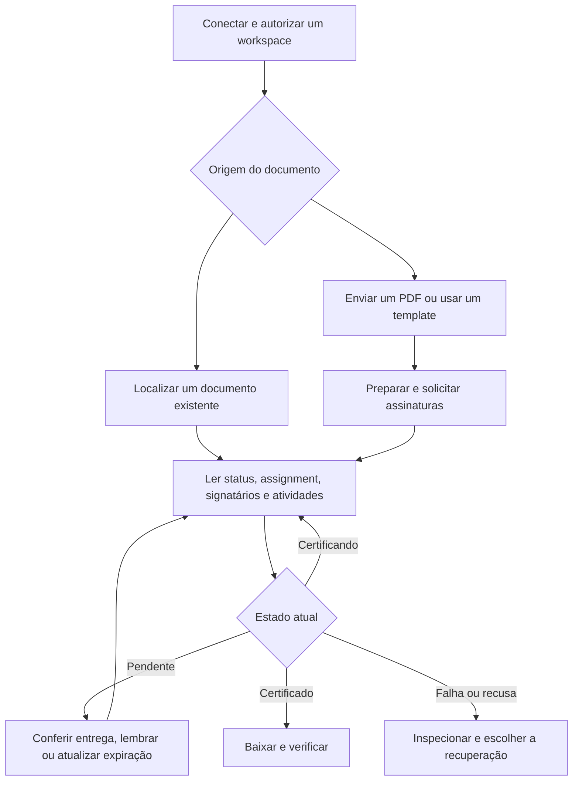

# Guia do cliente MCP da Assinafy

*Português · [Read in English](README.en.md)*

Conecte uma vez com **OAuth2 da Assinafy e CIMD** e conduza o ciclo de vida do
documento pelas ferramentas MCP: preparar e enviar, acompanhar status e entrega,
reenviar lembretes, atualizar a expiração, baixar artefatos e retomar trabalho
incompleto.

Use a URL HTTPS de Streamable HTTP terminada em `/mcp`; substitua o host de
exemplo pelo endpoint informado pelo operador. Claude e Codex descobrem suas
identidades CIMD automaticamente. O cliente não cria aplicativo OAuth nem informa
client ID, client secret, chave de API ou cabeçalho de workspace. Entre na
Assinafy, escolha um workspace e aprove as permissões solicitadas. O servidor
impõe esse workspace em todas as operações.

Conectar e listar as ferramentas não exigem login, então o cliente já mostra o
que o servidor oferece; o consentimento é pedido quando uma ferramenta precisa do
seu workspace. Os clientes abaixo se identificam por um Client ID Metadata
Document, que é como a Assinafy os reconhece; veja
[situação da conexão](#situação-da-conexão).

## Codex

```bash
codex mcp add assinafy --url https://mcp.assinafy.com.br/mcp
codex mcp login assinafy
```

O Codex descobre o recurso protegido e o servidor de autorização, usa sua própria
URL CIMD hospedada e abre o consentimento da Assinafy. Escolha o workspace e
aprove as permissões. Nada além disso pertence à configuração do usuário.
Veja a [documentação MCP do Codex](https://developers.openai.com/codex/mcp).

## Claude Code

```bash
claude mcp add --transport http assinafy https://mcp.assinafy.com.br/mcp
```

Abra `/mcp` no Claude Code e autentique na Assinafy. O Claude Code descobre o
suporte a CIMD pelo issuer; não informe client ID nem client secret. Veja a
[documentação MCP do Claude Code](https://code.claude.com/docs/en/mcp).

## Conectores remotos do Claude

Nas configurações de conectores do Claude, adicione um conector remoto
personalizado chamado Assinafy com a URL `https://mcp.assinafy.com.br/mcp`,
conecte e conclua o consentimento. Deixe as credenciais OAuth opcionais em branco
quando houver CIMD. A disponibilidade de conectores personalizados depende do
plano e das configurações da organização. O registro por linha de comando é do
Claude Code; um conector hospedado precisa da URL HTTPS pública.

O Claude escolhe CIMD quando os metadados do issuer anunciam ao mesmo tempo
`client_id_metadata_document_supported: true` e `none` em
`token_endpoint_auth_methods_supported`. O issuer da Assinafy anuncia os dois;
o cliente escolhe CIMD. Veja a
[autenticação de conectores do Claude](https://claude.com/docs/connectors/building/authentication).

## ChatGPT

Configure uma conexão MCP remota com OAuth e a URL da Assinafy. Escolha CIMD
quando a configuração oferecer a opção de registro. O ChatGPT suporta
autenticação de cliente público com `none`; o cliente não precisa de client
secret. Sua identidade de metadados e seu redirect são diferentes dos do Codex,
então o servidor de autorização precisa permitir os dois de forma independente.
Veja a [autenticação do ChatGPT](https://developers.openai.com/plugins/build/auth)
e os [requisitos de registro de cliente](#situação-da-conexão).

## VS Code / GitHub Copilot Chat

Adicione esta entrada à configuração MCP do VS Code:

```json
{
  "servers": {
    "assinafy": {
      "type": "http",
      "url": "https://mcp.assinafy.com.br/mcp"
    }
  }
}
```

Inicie o servidor e conclua a autorização no navegador. O VS Code escolhe CIMD
quando anunciado e sabe pedir escopos adicionais quando uma ferramenta precisa.
Veja o [suporte a autenticação do VS Code](https://code.visualstudio.com/updates/v1_106#_authentication-client-id-metadata-document-authentication-flow)
e a [configuração MCP](https://code.visualstudio.com/docs/agents/reference/mcp-configuration).

## Workspaces e permissões

Uma conexão autoriza um workspace. As ferramentas com escopo de conta descobrem
essa conta automaticamente. O argumento `account_id` pode repeti-la, mas não
seleciona outra. Conecte cada workspace adicional separadamente. Nunca coloque
chaves de API, tokens OAuth ou qualquer outra credencial em prompts, argumentos
de ferramenta ou `_meta`; requisições que os carregam são recusadas.

Você configura a URL do MCP. Os metadados anunciam
`account:read documents:read documents:write templates:read` para todo o catálogo.
O desafio de uma ferramenta pode pedir um conjunto menor; o consentimento exibido
depende do cliente. O conjunto completo cobre todas as ferramentas. Uma concessão
menor pode exigir novo consentimento antes de enviar. `templates:write` nunca é
pedido: nenhuma ferramenta altera um template. Peça `offline_access` quando o cliente usar refresh tokens
para acesso em segundo plano.

**A Assinafy impõe as permissões, e este servidor as reporta.** Os access tokens
são opacos, então o servidor não consegue ler o que a concessão permite e não
recusa uma escrita antecipadamente. Uma chamada recusada devolve a mensagem da
própria Assinafy nomeando o escopo que falta. Isso importa nas ferramentas de
várias etapas: com uma concessão parcial, `assinafy_request_signatures` (`action: "from_pdf"`)
pode enviar o PDF e ser recusada na etapa seguinte. O erro carrega o
`document_id` preservado, então continue por `assinafy_request_signatures` (`action: "from_document"`) em vez
de enviar o arquivo de novo. Aprovar o conjunto completo na conexão é o que torna
isso raro.

Para o Codex, autorize explicitamente o fluxo completo de documentos e templates:

```bash
codex mcp login assinafy --scopes account:read,documents:read,documents:write,templates:read,offline_access
```

O cliente guarda e renova os próprios tokens. O MCP não oferece ferramenta de
login, não aceita refresh tokens e não guarda credenciais do cliente. Concessões
expiradas ou revogadas retornam HTTP 401 na autenticação, ou erro de ferramenta
se a Assinafy recusar a operação enquanto uma decisão anterior está em cache.
Reconecte quando a renovação não restaurar a concessão.

## Comportamento na conversa

Comece pelo objetivo do usuário. Resolva nomes e reutilize os IDs já devolvidos;
não peça que a pessoa conheça identificadores da API. Faça uma pergunta curta
quando houver ambiguidade de destinatário, papel ou documento. Um pedido explícito
para enviar, lembrar ou excluir já autoriza aquela ação; não repita a confirmação.

| Pedido | Fluxo |
|---|---|
| “Envie este PDF para Ana.” | `assinafy_request_signatures` com `action: "from_pdf"`, após resolver o contato autorizado |
| “Use nosso template de NDA.” | Localizar template, papéis e campos; validar valores; solicitar com `action: "from_template"` |
| “Ana já assinou?” | Localizar o documento e consultar `action: "get"`; informar pendências e estado atual |
| “Lembre a Ana.” | Conferir o assignment; chamar `assinafy_follow_up_assignment` com `action: "resend"` para ela |
| “Baixe a cópia assinada.” | Conferir certificação e artefato; baixar com `action: "artifact"` e `artifact: "certificated"` |

O modelo escolhe a ferramenta e a ação. A resposta deve explicar o resultado em
linguagem comum, sem expor IDs ou base64 desnecessários. Leituras e preparação
não enviam convites. Consulte [todas as ferramentas e entradas](docs/tools.md).

## Fluxo do documento

Todas as operações de documento passam pelo MCP com a concessão OAuth2 da
conexão. O cliente cuida de access tokens, refresh tokens e novo consentimento. O
servidor publica 11 ferramentas por tarefa, cobrindo 24 operações, e fornece
instruções de fluxo na inicialização do MCP. Os nomes anteriores foram substituídos.
Atualize a lista de ferramentas após a implantação e adapte chamadas explícitas
pela [referência e tabela de migração](docs/tools.md#migrating-from-per-operation-tools). Não há ferramenta de login nem necessidade de chamar a
API REST pela conversa.



### 1. Localizar o documento e conferir seu estado

Use `assinafy_find_documents` (`action: "list"`) com `search`, `status`, `page` e `per_page`. Ele
também aceita `sort`, que recebe `name` ou `updated_at`, opcionalmente prefixado
por `-` para inverter a ordem. As páginas
começam em 1 e trazem no máximo 100 registros; siga o `meta` de paginação
retornado em vez de supor que a primeira página contém todos os documentos.

Por exemplo, chame `assinafy_find_documents` (`action: "list"`) com:

```json
{
  "action": "list",
  "status": "pending_signature",
  "sort": "-updated_at",
  "page": 1,
  "per_page": 25
}
```

Identificado o documento correto, chame `assinafy_find_documents` (`action: "get"`):

```json
{
  "action": "get",
  "document_id": "DOCUMENT_ID"
}
```

Use os IDs devolvidos pela Assinafy em todas as chamadas seguintes. Não invente
IDs nem deduza o ID do assignment a partir do ID do documento. Os detalhes do
documento expõem o `status` atual, `is_closed`, `assignment`, os registros de
signatários, IDs de página, artefatos e qualquer motivo de recusa informado pela
Assinafy. O ciclo de vida documentado é:

| Estado | Próximo passo |
|---|---|
| `uploading`, `uploaded`, `metadata_processing` | O processamento não terminou. Verifique depois; assignments `collect` precisam dos metadados de página prontos. |
| `metadata_ready` | Inspecione ou renomeie o PDF e prepare a solicitação de assinatura. |
| `pending_signature` | Inspecione signatários pendentes, ordem de assinatura, histórico de entrega e expiração. |
| `certificating` | Todas as assinaturas podem estar presentes enquanto os artefatos finais ainda são gerados. |
| `certificated` | Baixe os artefatos assinados disponíveis. Este estado não é excluível pela API documentada. |
| `expired` | Inspecione o assignment e decida se atualiza a expiração. A Assinafy valida se a atualização é permitida. |
| `rejected_by_signer`, `rejected_by_user` | Leia os detalhes da recusa e escolha o próximo passo com o usuário. Um lembrete não reverte uma recusa. |
| `failed` | Leia as atividades do documento e o erro antes de escolher a recuperação. |

As conferências de status são leituras individuais, não assinaturas de eventos.
Use consultas com limite quando pedirem para acompanhar um documento; pare em um
estado terminal ou no tempo combinado.

### 2. Inspecionar progresso e entrega

Use `assinafy_find_documents` (`action: "get"`) para identificar quem realmente está pendente. O
assignment traz `id`, `signers[].id`, `completed`, `step`, `notified`,
`notification_history` e as URLs de assinatura quando disponíveis. Campos
opcionais ausentes significam que a API não forneceu aquela informação. Um
signatário aguardando uma etapa anterior não está necessariamente sofrendo falha
de entrega.

Chame `assinafy_find_documents` (`action: "activities"`) com `document_id` para a linha do tempo
dos eventos, incluindo data e payload de cada um. Inspecione
`notification_history` em busca de eventos enviados/falhos e detalhes de erro.
Para entrega por WhatsApp, chame `assinafy_find_documents` (`action: "notifications"`) com
`document_id` e `assignment_id`. Mensagens de WhatsApp em staging podem ser
simuladas. Trate links e códigos de acesso retornados como sensíveis e
compartilhe apenas com os destinatários autorizados.

**100% de progresso não prova que o PDF certificado está pronto.** Confira o
estado do ciclo de vida e a disponibilidade do artefato antes de baixá-lo.

### 3. Reenviar um lembrete

Leia o documento de novo, identifique o signatário pendente e a etapa ativa, e
confirme que a instrução do usuário autoriza aquele lembrete. Escopos OAuth
autorizam o acesso a uma operação; eles não escolhem um destinatário pelo
usuário. Um lembrete consome créditos de notificação. Um pedido explícito de
lembrete já autoriza aquela ação; pergunte apenas se o destinatário ou a ação
estiverem ambíguos. Chame `assinafy_follow_up_assignment` (`action: "resend"`) com:

```json
{
  "action": "resend",
  "document_id": "DOCUMENT_ID",
  "assignment_id": "ASSIGNMENT_ID",
  "signer_id": "SIGNER_ID"
}
```

`is_sent: true` informa o resultado do reenvio; não significa que a pessoa
assinou. Leia o histórico de entrega e o progresso depois. Não reenvie
repetidamente só porque o progresso não mudou. Uma resposta incerta pode vir
depois de um envio bem-sucedido; inspecione as atividades antes de tentar de
novo. Respeite limites de taxa e o tempo de nova tentativa.

### 4. Atualizar a expiração ou corrigir dados do destinatário

Use `assinafy_follow_up_assignment` (`action: "set_expiration"`) com os IDs dos detalhes atuais do
documento e um timestamp RFC 3339 explícito:

```json
{
  "action": "set_expiration",
  "document_id": "DOCUMENT_ID",
  "assignment_id": "ASSIGNMENT_ID",
  "expires_at": "2027-01-31T23:59:59-03:00"
}
```

Escolha a data e o fuso realmente pedidos pelo usuário; o exemplo ilustra apenas
o formato. Leia o assignment atualizado para confirmar a data resultante. Não
suponha que atualizar a expiração também enviou um novo convite.

Encontre contatos por `assinafy_find_signers` (`action: "list"`) ou `assinafy_find_signers` (`action: "get"`).
`assinafy_save_signer` (`action: "update"`) aceita `full_name`, `email`, `whatsapp_phone_number` e
`government_id`. Um contato é compartilhado dentro do workspace, então revise a
alteração pretendida antes de aplicá-la. A Assinafy bloqueia mudanças em um canal
já verificado em um documento em andamento. Alterar um canal não verificado
invalida links e códigos antigos; depois de uma correção bem-sucedida, use um
reenvio autorizado para entregar o link novo. Preserve e informe uma recusa da
Assinafy.

### 5. Preparar e enviar um novo PDF

Para o fluxo comum por e-mail, chame `assinafy_request_signatures` (`action: "from_pdf"`):

```json
{
  "action": "from_pdf",
  "file_name": "contrato.pdf",
  "file_base64": "BYTES_DO_PDF_EM_BASE64",
  "signers": [
    {
      "full_name": "Pessoa de Exemplo",
      "email": "signer@example.invalid"
    }
  ],
  "message": "Revise e assine o documento",
  "max_wait_secs": 30
}
```

O endereço é fictício. Informe apenas destinatários autorizados para a tarefa
real. A ferramenta envia o PDF, aguarda o processamento, cria ou reutiliza
contatos de e-mail e inicia um assignment com verificação e convite por Email.
Guarde `document.id`, `assignment.id` e `signer_ids` do resultado.

Para preparar antes de enviar, use esta sequência:

1. `assinafy_prepare_document` (`action: "upload"`) aceita `file_name` e `file_base64`, devolve um
   documento e não envia convites. PDFs podem ter até 25 MiB e 2.000 páginas; a
   Assinafy impõe o limite de páginas. O servidor MCP nunca abre um caminho de
   arquivo local.
2. `assinafy_find_documents` (`action: "get"`) confere a prontidão e fornece IDs e dimensões de
   página. Use `assinafy_prepare_document` (`action: "rename"`) com `document_id` e `name` enquanto
   renomear é permitido: antes de existir um assignment, em `uploaded` ou
   `metadata_ready`.
3. `assinafy_find_signers` (`action: "list"`) / `assinafy_save_signer` (`action: "create"`) fornecem os IDs dos
   signatários. Criar um contato sozinho não envia solicitação de assinatura. A
   criação avulsa pode retornar conflito; procure o contato existente antes de
   tentar de novo.
4. `assinafy_request_signatures` (`action: "from_document"`) inicia a assinatura do documento existente usando
   os IDs de signatário. Consome a franquia de documentos da workspace e, no
   WhatsApp, créditos de notificação — use os destinatários e a ação autorizados pelo usuário. Guarde o
   assignment e as identidades retornadas para o acompanhamento.

Exemplo de argumentos de `assinafy_request_signatures` (`action: "from_document"`):

```json
{
  "action": "from_document",
  "document_id": "DOCUMENT_ID",
  "method": "virtual",
  "signers": [
    {
      "id": "SIGNER_ID",
      "verification_method": "Email",
      "notification_methods": [
        "Email"
      ],
      "step": 1
    }
  ],
  "message": "Revise e assine o documento"
}
```

A ferramenta de assignment aceita `virtual` e `collect`, `copy_receivers`
opcionais (IDs de signatário), `message`, `expires_at` e ordem de assinatura por
`step`. Os métodos de verificação são `Email`, `Whatsapp` e
`DigitalCertificate`; as notificações usam os canais Email/WhatsApp
documentados. WhatsApp exige o contato e a assinatura de plano adequados;
assinatura com certificado exige os dados de identidade do signatário e o
recurso habilitado na conta. A Assinafy valida esses requisitos. Nenhuma resposta
traz custo ou saldo: criar um documento e enviar uma notificação por WhatsApp
consomem a franquia de documentos e os créditos de notificação da workspace pelas
taxas publicadas, e o saldo restante se consulta no Assinafy, não por este
servidor. Reutilize a autorização do usuário para a ação pedida; pergunte apenas
por escolhas de documento ou destinatário que ainda faltam. Não repita uma chamada
só porque o progresso parece parado.

Na assinatura ordenada, se um signatário informar `step`, todos precisam
informar; os valores devem ser contíguos a partir de 1. Pessoas na mesma etapa
assinam em paralelo. Um signatário com certificado digital fica sozinho na etapa
dele.

Para `collect`, aguarde `metadata_ready`. Use `assinafy_check_fields` (`action: "list"`)
(opcionalmente `include_standard: true`) e `assinafy_check_fields` (`action: "get"`) para as
definições de campo. Passe `entries[]` com `page_id` e `fields[]`; cada
posicionamento contém `signer_id`, `field_id` e `display_settings` com `left`,
`top`, `width`, `height` e `fontSize`. As coordenadas usam os pixels da imagem da
página em 150 DPI. O servidor recusa posicionamentos fora da página escolhida
antes de criar o assignment. As prévias de página estão em
`assinafy_download_document` (`action: "page"`).

#### Validar valores de campo

Use `assinafy_check_fields` (`action: "list"`) e `assinafy_check_fields` (`action: "get"`) para inspecionar as definições
e valide os valores propostos com `assinafy_check_fields` (`action: "validate"`):

```json
{
  "action": "validate",
  "values": [
    {
      "field_id": "ID_DO_CAMPO_NOME",
      "value": "Empresa Exemplo"
    },
    {
      "field_id": "ID_DO_CAMPO_TOTAL",
      "value": "1250.00"
    }
  ]
}
```

O MCP converte `values` no corpo em array JSON da API. A validação não cria
documento nem envia convites. Verifique `success` e `error_message` de cada
resultado; uma requisição HTTP bem-sucedida pode reportar um valor inválido.
Mantenha como texto os identificadores com zeros à esquerda. O
`editor_fields[].value` de template sempre recebe uma string, mesmo quando o
valor representa número ou data.

### 6. Gerar um documento a partir de um template

Use `assinafy_find_templates` (`action: "list"`) e leia seus papéis, páginas e campos de editor.
`assinafy_find_templates` (`action: "get"`) oferece a consulta direta onde o ambiente suporta essa
rota de compatibilidade. A resposta da listagem é a fonte documentada quando a
rota individual não está disponível.

Para um pedido como “preencha `customer_name` e `contract_total` no template de
contrato de serviço”, resolva os nomes antes de criar qualquer coisa:

1. Selecione o template pedido em `assinafy_find_templates` (`action: "list"`), seguindo a
   paginação, e inspecione seu status de processamento, `roles` e
   `pages[].fields`.
2. Relacione os nomes pedidos aos `label` dos posicionamentos ou às definições
   devolvidas por `assinafy_check_fields` (`action: "list"`) / `assinafy_check_fields` (`action: "get"`). Ligue o `id` da
   definição ao `field_id` do posicionamento e confira o `role_id` do
   posicionamento contra o papel de editor do template. Preencha apenas campos já
   configurados naquele template.
3. Use o **`field_id`** do posicionamento em `editor_fields` — não o `id` do
   posicionamento nem seu rótulo. Nomes de campo são configuráveis; eles não são
   nomes de argumento de ferramenta. O cliente faz esse mapeamento pelos
   metadados; o servidor aceita IDs.
4. Se os nomes faltarem ou forem ambíguos, peça ao usuário que identifique o
   campo pretendido. Não adivinhe. Posicionamentos repetidos com o mesmo
   `field_id` recebem um único valor; a API não oferece valor por posicionamento
   nesta requisição.
5. Valide os valores propostos e resolva um signatário por papel do template
   antes da criação autorizada.

Criação de template e edição de layout e papéis são documentadas apenas na API
interna e não são expostas por este servidor. Configure o template salvo na
Assinafy antes de usar o fluxo público de documento por template.

`assinafy_request_signatures` (`action: "from_template"`) preenche todos os papéis. Cada entrada
traz o `id` de um signatário existente **ou** `full_name` e `email`, que o
servidor cria ou reutiliza — um ou outro, nunca os dois na mesma entrada, de modo
que uma única chamada combina signatários do diretório e contatos novos. As
entradas também aceitam `verification_method`, `notification_methods` e `step`
conforme documentado. Uma entrada resolvida por email usa verificação e
notificação por Email; informar só o método de notificação deixa a Assinafy
inferir a verificação correspondente. Cada entrada de template aceita no máximo
um canal: `Email` ou `Whatsapp`. O servidor valida todas as entradas antes de criar
contatos. A Assinafy ainda valida os papéis e a ordem de assinatura, então uma falha
posterior pode deixar contatos recém-criados.

A chamada aceita nome personalizado, mensagem, expiração, `tags` (**nomes** de
tag, mesclados com os padrões do template) e `editor_fields` com
`{field_id,value}`. A criação pode enviar convites e consome a franquia de
documentos do workspace; use o documento e os destinatários autorizados pelo usuário. Guarde o ID do
documento retornado e chame `assinafy_find_documents` (`action: "get"`) para o assignment e as
conferências de status seguintes.

Os argumentos de criação ficam assim (substitua pelos IDs descobertos no template
e no diretório de signatários):

```json
{
  "action": "from_template",
  "template_id": "TEMPLATE_ID",
  "name": "Contrato de serviço.pdf",
  "signers": [
    {
      "role_id": "ID_DO_PAPEL_EDITOR",
      "id": "ID_DO_SIGNATARIO_PREPARADOR",
      "step": 1
    },
    {
      "role_id": "ID_DO_PAPEL_CLIENTE",
      "full_name": "Cliente Exemplo",
      "email": "cliente@example.com",
      "step": 2
    }
  ],
  "editor_fields": [
    {
      "field_id": "ID_DO_CAMPO_NOME",
      "value": "Empresa Exemplo"
    },
    {
      "field_id": "ID_DO_CAMPO_TOTAL",
      "value": "1250.00"
    }
  ]
}
```

As conferências de status, lembretes, mudanças de expiração e downloads seguintes
usam os IDs do documento retornado, como em um PDF enviado.

### 7. Inspecionar prévias de página

`assinafy_download_document` (`action: "page"`) recebe `document_id` e um `page_id` retornado.
Devolve os bytes da imagem em base64. Baixe apenas as páginas necessárias.

### 8. Baixar artefatos assinados e verificar

Concluída a certificação, chame `assinafy_download_document` (`action: "artifact"`) com o ID do
documento e `artifact: "certificated"`. O resultado traz `document_id`, o nome do
artefato e `base64`. Decodifique e salve os bytes pelas ferramentas de arquivo do
cliente; não imprima um base64 grande na conversa.

A ferramenta também aceita `original`, `certificated`, `certificate-page`,
`pades` e `bundle`. A disponibilidade do artefato depende do ciclo de vida e do
método de assinatura; um artefato indisponível não é um download bem-sucedido. As
respostas binárias são limitadas a 64 MiB antes da codificação base64.

Chame `assinafy_verify_document` com o hash SHA-1 de assinatura do documento
assinado. Use o hash de verificação real fornecido com o documento, não o ID do
documento nem um valor inventado. Esta é a única ferramenta que funciona sem
conectar: ela consulta um registro público de assinatura e não toca em nada
pertencente a um workspace. Informe o `is_valid` retornado.

As pessoas concluem assinaturas, recusas e verificações exigidas dentro da
Assinafy. Esses endpoints usam o código de acesso do signatário, fora da
concessão OAuth2 do workspace. Estas ferramentas não aceitam termos, não digitam
códigos de verificação e não assinam no lugar de ninguém.

### 9. Retomar uma operação parcial ou excluir

Um envio de várias etapas pode falhar depois do upload. O erro preserva o ID do
documento criado. Inspecione esse documento e suas atividades antes de
continuar:

- Um assignment existente indica que a solicitação de assinatura pode já ter dado
  certo. Continue acompanhando; não crie outro assignment nem reenvie às cegas.
- Um documento preparado sem assignment continua por
  `assinafy_request_signatures` (`action: "from_document"`) com os IDs de signatário confirmados. Não precisa
  de novo upload. Confira o status de processamento antes de posicionar campos.
- Se pedirem limpeza, use `assinafy_delete_document` apenas quando o estado atual
  do documento permitir. Essa ação precisa de autorização do usuário.

Nenhuma requisição de escrita é repetida automaticamente pelo servidor MCP.

## Erros e reconexão

| Resultado | Ação do cliente |
|---|---|
| HTTP 401 | Deixe o cliente renovar a concessão ou reconectar pelo consentimento da Assinafy. |
| HTTP 403 com `insufficient_scope` | Autorize o conjunto de escopos pedido e tente de novo após o consentimento. |
| Erro de ferramenta nomeando um escopo ausente | A Assinafy recusou a chamada. Uma ferramenta de várias etapas pode ter concluído etapas anteriores; leia o erro em busca de um `document_id` preservado e continue dali. |
| Resultado de ferramenta com `isError: true` | Leia o erro da Assinafy e inspecione o documento atual antes de repetir uma escrita. |
| Contato inválido, assignment expirado ou artefato indisponível | Corrija a requisição ou aguarde o estado necessário do ciclo de vida. |
| Limite de taxa ou resposta de rede incerta | Respeite o tempo de nova tentativa; inspecione o estado e o histórico de entrega antes de repetir uma escrita. |
| HTTP 429 | A Assinafy está limitando as verificações de autorização; respeite o `Retry-After`. |
| HTTP 503 na autenticação | A Assinafy estava inacessível durante a verificação do token; tente de novo. Não existe alternativa por chave de API no fluxo do cliente. |

Veja [erros e recuperação](docs/errors.md) e a [referência de entradas](docs/tools.md).

## Situação da conexão

Este guia descreve o catálogo de 11 ferramentas introduzido em `v3.0.0`.
Servidores na versão v2.x expõem 24 ferramentas. Implante a v3 antes de usar os
novos nomes e atualize o catálogo do cliente. Conectar e listar ferramentas não
exige credencial; confira o catálogo implantado com:

```bash
curl -sS -X POST https://mcp.assinafy.com.br/mcp \
  -H 'Content-Type: application/json' \
  -H 'Accept: application/json, text/event-stream' \
  -d '{"jsonrpc":"2.0","id":1,"method":"tools/list"}'
```

A descoberta pública anuncia CIMD, autenticação de cliente público e PKCE S256.
Isso não comprova um login completo. O operador também precisa verificar estas
configurações do servidor de autorização por consentimento no navegador:

| Configuração | Verificação |
|---|---|
| Confiança no cliente | Permitir a URL CIMD e o redirect reais do cliente. `invalid_client` pode indicar falta na lista de confiança. Um erro de registro dinâmico também pode indicar falha de descoberta CIMD; confira os metadados e a versão do cliente antes de mudar o registro. |
| Registro do recurso | O cliente envia `https://mcp.assinafy.com.br/mcp` como `resource`. A Assinafy pode responder `invalid_target` enquanto essa URL não estiver registrada como recurso para o qual emite tokens. |

A validação de audiência continua sendo uma limitação conhecida na v3.0.0.
A consulta atual de workspace não comprova que o token foi emitido para este
recurso MCP. Uma integração posterior com o servidor OAuth2 deve comprovar e
validar esse vínculo; alterar a configuração do cliente não resolve a limitação.

As credenciais OAuth2 ficam no armazenamento do cliente. O servidor não tem
credenciais próprias: verifica o bearer na Assinafy, repassa-o sem alteração e
não guarda tokens em disco.
